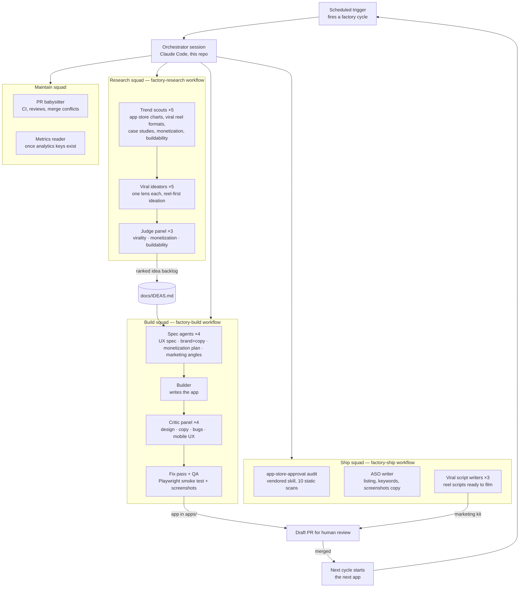

# The App Factory

A continuously running, agent-swarm business that ideates, builds, ships, and maintains
consumer apps — working backwards from the marketing, per the Roy Lee framework
(see [PLAYBOOK.md](PLAYBOOK.md)).

The unit of work is a **cycle**. Every cycle either advances the current app toward
shipped/monetized, or starts the next app. Cycles run 24/7 on a schedule (see
"The continuous loop" below); a human reviews via pull requests.

## Architecture

A full cycle runs **20–30 agents**; the design scales to hundreds by fanning out more
ideation lenses, more critics, and per-app maintain squads — every squad is a
parameterized workflow in [`.claude/workflows/`](.claude/workflows/), so scale is a
number, not a rewrite.

## The pipeline, stage by stage

| Stage | Workflow | Input | Output | Done when |
|---|---|---|---|---|
| 1. Research | `factory-research` | nothing (or a theme) | ranked idea backlog → `docs/IDEAS.md` | ≥10 ideas scored by 3 judges |
| 2. Pick | orchestrator | `docs/IDEAS.md` | one idea, one viral reel | top-ranked idea with no fatal flaw |
| 3. Build | `factory-build` | the idea + reel | polished PWA in `apps/<name>/` | critic panel passes, QA screenshots clean |
| 4. Ship prep | `factory-ship` | the app | audit report, ASO listing, 3 reel scripts | zero HARD BLOCK findings |
| 5. Review | human | draft PR | merge or feedback | PR merged |
| 6. Next | orchestrator | — | new cycle for the next idea | forever |

## Product strategy

- **PWA first.** Every app is a self-contained, installable progressive web app —
  zero backend, zero API keys, deployable to any static host the moment a domain
  exists. This is what lets the factory ship in days.
- **App Store second.** Once an app proves demand, wrap it with Capacitor and run the
  vendored [`app-store-approval`](.claude/skills/app-store-approval/SKILL.md) audit
  before submission. (Requires the human's Apple Developer account — see
  [docs/NEEDS-FROM-HUMAN.md](docs/NEEDS-FROM-HUMAN.md).)
- **The result screen is the ad.** Every app must produce a screenshot-worthy,
  shareable result card — that card is the viral reel's payload.
- **Paywall from day one.** Every app has a designed paywall moment (soft-locked
  premium features). Turning it into real revenue requires Stripe/RevenueCat keys —
  the UI ships first, the key drops in later.

## The continuous loop

The factory is driven by a scheduled trigger (a Claude Code Routine) that fires a
cycle prompt into the orchestrator session on a fixed cadence. Each firing:

1. Checks the state of the current app's PR (merge conflicts, CI, review comments).
2. If the current app is shipped/merged → runs `factory-research` for fresh ideas and
   starts the next app with `factory-build`.
3. If the current app is mid-flight → advances it (fixes, ship-prep, marketing kit).
4. Commits, pushes, updates the PR. Everything lands on GitHub; nothing exists only
   in a container.

Pause the loop anytime by disabling the Routine (ask the orchestrator, or
claude.ai/code → Routines). Cadence is adjustable the same way.

## Honest constraints (read this)

Agents can research, design, build, audit, document, and maintain — end to end.
Four things structurally require a human or a key, and the factory is designed so
they're each a **single drop-in step**, listed with exact instructions in
[docs/NEEDS-FROM-HUMAN.md](docs/NEEDS-FROM-HUMAN.md):

1. **Hosting/domain** — a Vercel/Netlify/Cloudflare token makes deploys automatic.
2. **Payments** — Stripe or RevenueCat keys turn the built paywalls into revenue.
3. **App Store** — Apple Developer account ($99/yr) for native distribution.
4. **Posting content** — TikTok/IG accounts; the factory writes ready-to-film reel
   scripts, a human (or a posting API later) publishes them.

No revenue number is guaranteed. The factory's job is to make the attempts cheap,
fast, constant, and well-marketed — that is the entire thesis.
